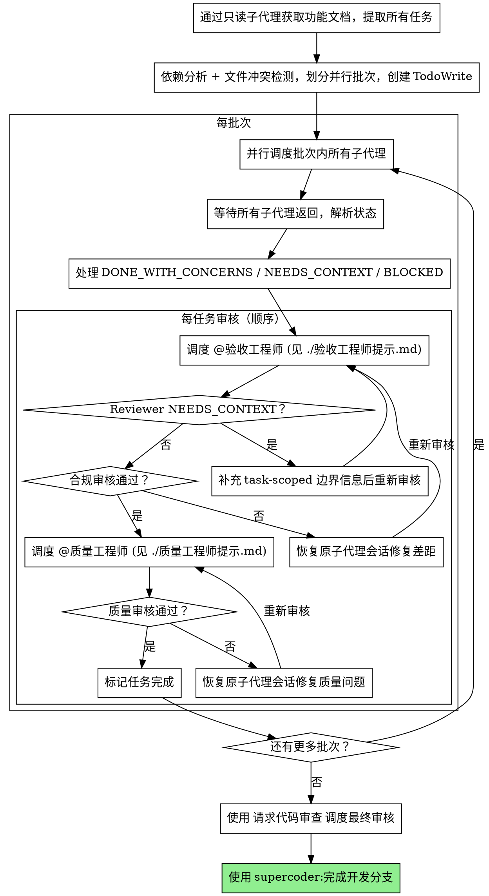

# 子代理协调

主代理永远不动手执行任何实际工作。所有执行由子代理完成，主代理只负责理解用户意图、拆分任务、派遣子代理、审核结果、向用户汇报。

**核心原则：** 主代理 = 纯协调者。依赖分析 + 并行批次调度 + 两阶段审核 = 高质量、快速迭代。

## ⚡ 快速模式（SUPERCODER_TDD=false 且/或 SUPERCODER_CODE_REVIEW=false）

根据项目根目录 `.env` 中的变量组合，调整执行流程：

- **SUPERCODER_TDD=false**：子代理跳过 TDD，直接以最快方式实现
- **SUPERCODER_CODE_REVIEW=false**：**跳过所有审核**，不调度 `@验收工程师`、`@质量工程师`、`@评审工程师`；每个任务子代理返回 DONE 后，直接进入下一个任务，无需任何审核循环；全部任务完成后，跳过 `请求代码审查` 步骤，直接完成开发分支
- **DONE_WITH_CONCERNS / NEEDS_CONTEXT / BLOCKED 依然需要处理**（这些是阻塞性状态，不是审核）

SUPERCODER_CODE_REVIEW=false 时的简化流程：

```
[从功能文档提取任务] → [依赖分析 + 批次划分] → [并行调度子代理]
→ [子代理返回 DONE] → [下一个任务，无需审核]
→ [所有任务完成] → [直接完成开发分支]
```

**只有用户明确要求或将对应变量设为 true 后，才恢复下方的完整审核流程。**

---

## 铁律

```
主代理不可以：读取文件；写入、修改、创建任何文件；运行任何有副作用的命令
```

这条规则没有例外。哪怕是一行字的改动，也通过子代理执行。**文件读取同样如此：主代理需要了解某个文件的内容，必须派遣只读子代理读取并以结构化格式返回；主代理不直接调用 Read 工具。**

## 何时使用

任何需要实际执行的工作都使用此 skill：

- 写代码、修 bug、重构
- 修改文档或配置文件
- 调查问题、搜索代码库
- 运行测试或命令
- 任何涉及文件读写的操作

**需要了解文件内容以写出子代理指令时：** 派遣 `@项目讲解师` 并在传入上下文中说明需要了解的文件路径，子代理会返回结构化摘要，主代理基于摘要写指令。**主代理不直接读文件。**

## 流程（SUPERCODER_CODE_REVIEW=true）



## 依赖分析与批次划分

### 文件冲突检测

两个任务涉及相同文件，不能并行：

- 任务 A 创建 `foo.ts` + 任务 B 创建 `foo.ts` → **冲突**
- 任务 A 修改 `foo.ts` + 任务 B 修改 `foo.ts` → **冲突**
- 任务 A 创建 `foo.ts` + 任务 B 修改 `foo.ts` → **冲突**
- 任务 A 测试 `test_a.ts` + 任务 B 测试 `test_b.ts` → **不冲突**

### 逻辑依赖

任务 B 使用任务 A 定义的接口/类型/函数 → B 必须在 A 完成后才能调度。

### 批次生成

```
批次 1: [任务1, 任务3, 任务5]  ← 三者无冲突无依赖，并行调度
批次 2: [任务2, 任务4]          ← 依赖批次1，但彼此独立，并行调度
批次 3: [任务6]                 ← 依赖批次2
```

**不确定是否有冲突时，默认顺序执行。**

## 并行调度安全检查

在并行调度前逐项确认：

- 每个任务都能用一句话单独定义
- 每个任务需要的上下文可以单独给全
- 每个任务的输出彼此独立
- 一个任务失败不会让另一个任务的结论失效
- 不存在共享文件编辑风险

有任一项不确定，就顺序执行。

## Worktree 强制隔离

**所有涉及文件写操作的子代理任务，必须在 Git worktree 中进行。无论任务数量、大小、复杂度，没有例外。**

只读任务（调查、分析、审查）在主目录进行，不需要 worktree。

### 为什么强制

用户可能同时开启多个 OpenCode 会话。如果多个会话都在主目录修改文件，会互相踩踏。Worktree 提供会话级文件隔离，主目录成为只读协调空间。

### 前置检查（硬门禁）

创建 worktree 前，必须通过子代理验证：

```bash
test -z "$(git status --porcelain)"
```

**如果主目录不干净（有未提交变更），停止所有后续步骤。** 通知用户先 commit 或 stash。不要尝试自动 stash。

### Worktree 创建

通过子代理执行（主代理不直接运行 bash）：

```bash
# 生成 4 位随机后缀
SUFFIX=$(openssl rand -hex 2)

# 创建 worktree
git worktree add "<项目父目录>/<项目名>-wt-<task-id>-${SUFFIX}" -b "wt/<task-id>-${SUFFIX}"

# 安装依赖（如果项目需要）
cd "<worktree-path>" && npm install
```

命名规则：
- 路径：`<项目父目录>/<项目名>-wt-<task-id>-<4位hex>`
- 分支：`wt/<task-id>-<4位hex>`
- 4 位随机后缀确保多会话不冲突

### Worktree 子代理调度

在子代理 prompt 中注入 **Worktree 工作指令**（见 `./开发工程师提示.md` 中的 Worktree 模式段落），包含：
- worktree 绝对路径（使用实际路径，不用占位符）
- 分支名
- 所有文件操作使用绝对路径的规则

### 合并

任务完成后，通过子代理在主目录执行顺序合并：

```bash
cd <project-dir>
git merge wt/<task-id>-<suffix> --no-edit
```

**冲突处理：**
- 简单冲突（不同行）：git 自动解决
- 复杂冲突：派 @开发工程师 在主目录解决
- 不可解冲突：`git merge --abort`，保留分支，报告用户

**跨会话 lock 竞态：** 合并失败 + lock 错误 → 等 3 秒重试，最多 3 次。区分 lock 竞态和真正冲突。

### 清理

合并成功后立即通过子代理清理：

```bash
git worktree remove <worktree-path>
git branch -d wt/<task-id>-<suffix>
git worktree prune
```

### 崩溃恢复

如果会话启动时发现残留 worktree（`git worktree list` 显示非主 worktree），提示用户决定是否清理。有未提交变更的 worktree 不自动删除。

### Worktree 模式下的审核

审核型子代理（@验收工程师、@质量工程师）**不在 worktree 中运行**。它们审核子代理的报告内容，如需读取代码验证，使用 worktree 的绝对路径即可。

## 子代理指令必须自包含

给每个子代理至少提供：

- 明确范围（只做什么，不做什么）
- 完整任务描述（基于功能文档摘要或只读子代理返回的结构化内容组装，不让子代理自行读文件）
- 允许修改的文件列表
- 架构上下文（够理解任务即可，不是整个代码库）
- 明确返回格式（见 `./开发工程师提示.md`）

## 处理子代理状态（SUPERCODER_CODE_REVIEW=true 时含审核衔接说明）

子代理返回纯文本结果，从中解析状态关键词：

**DONE：** SUPERCODER_CODE_REVIEW=true 时，继续进行功能合规审核。SUPERCODER_CODE_REVIEW=false 时，直接进入下一个任务。

**DONE_WITH_CONCERNS：** 子代理完成了工作但标记了疑虑。先读疑虑。如果疑虑关于正确性或范围，在审核之前解决。如果是观察性备注，记录后继续审核。

**NEEDS_CONTEXT：** 子代理需要未提供的信息。提供缺失的上下文，在同一个子代理会话里继续工作。

**BLOCKED：** 子代理无法完成任务。评估阻塞：

1. 上下文问题 → 提供更多上下文并恢复原会话
2. 任务太大 → 拆分成更小的块
3. 计划本身错误 → 上报给用户

**会话句柄纪律（SUPERCODER_CODE_REVIEW=true）：** 只要任务还没通过两阶段审核，不要丢弃子代理的会话句柄。后续的合规修复、质量修复和继续实现都依赖同一个可恢复会话。

## 审核修复循环（SUPERCODER_CODE_REVIEW=true）

审核在批次内顺序进行。发现问题时：

1. 恢复原子代理会话
2. 将 reviewer 的问题反馈给子代理
3. 子代理修复后返回
4. 再次调度 reviewer 验证
5. 重复直到通过

**顺序强制：功能合规审核必须先通过，才能进行代码质量审核。**

**Reviewer NEEDS_CONTEXT：** 子代理的报告已经包含任务描述和 diff 摘要，直接检查报告是否完整。如果报告缺少必要信息，恢复原子代理会话要求补充报告，然后重新调度 reviewer。**主代理不要自己跑 git diff 去补充信息**——这违反上下文干净原则。

## Prompt 模板

- `./开发工程师提示.md` — 调度 `@开发工程师` 子代理的任务 prompt 模板（报告格式设计为可直接转发给 reviewer）
- `./验收工程师提示.md` — 调度 `@验收工程师` 子代理的任务 prompt 模板
- `./质量工程师提示.md` — 调度 `@质量工程师` 子代理的任务 prompt 模板
- 最终全局代码审核（SUPERCODER_CODE_REVIEW=true）使用 `supercoder:请求代码审查` 提供的审查标准

**主代理与 reviewer 的交互模式：** 收到子代理报告后，主代理将报告**整体转发**给 reviewer，不重新读文件、不跑 git diff、不重新组装上下文。子代理的报告格式已经确保包含 reviewer 所需的全部信息。

## 示例工作流（SUPERCODER_CODE_REVIEW=true）

```
[从功能文档提取 5 个任务]

依赖分析 → 批次划分：
  批次 1: [任务 1, 2, 3] ← 并行
  批次 2: [任务 4, 5]    ← 依赖批次 1，彼此独立，并行

═══ 批次 1 ═══
[并行调度 3 个子代理]
  任务 1: DONE / 任务 2: DONE_WITH_CONCERNS / 任务 3: DONE

[逐任务两阶段审核]
  任务 1: 合规 ✅ → 质量 ✅
  任务 2: 合规 ❌(缺验证规则) → 恢复子代理修复 → 合规 ✅ → 质量 ✅
  任务 3: 合规 ✅ → 质量 ❌(魔法字符串) → 恢复子代理修复 → 质量 ✅

═══ 批次 2 ═══
[并行调度 2 个子代理 → 审核 → 修复循环]

═══ 全局审核 ═══
[请求代码审查 → 完成开发分支]
```

## 红线

**主代理铁律：**

- **不写、不修改、不创建任何文件** — 哪怕一行注释也不行
- **不运行有副作用的命令** — git commit、npm install、文件移动等均由子代理负责
- **不自己实现然后"让子代理审核"** — 这是在用审核名义自己动手

**调度纪律：**

- 在没有明确用户同意的情况下不在 main/master 分支上开始实施
- 不跳过审核（功能合规或代码质量）（SUPERCODER_CODE_REVIEW=true 时）
- 在问题未修复的情况下不继续
- 不让子代理读取功能文档自取上下文（改为直接提供完整文本）
- 不跳过场景设置上下文
- 不忽略子代理的问题
- 功能合规为 ✅ 之前不开始代码质量审核
- 任一审核有开放问题时不转到下一个任务
- **不并行调度涉及相同文件的任务**
- **不确定是否有冲突时不并行调度**
- 不跳过依赖分析直接并行调度所有任务
- **不允许子代理嵌套派遣子代理**（只有主代理可以调度子代理）

**如果子代理提问：**

- 清晰完整地回答
- 如需要提供额外上下文
- 不要催促他们实施

**如果 reviewer 发现问题：**

- 恢复原子代理会话进行修复
- Reviewer 再次审核
- 重复直到批准
- 不要跳过重新审核

**如果子代理任务失败：**

- 用具体指令调度修复子代理
- 不要尝试主代理手动修复（上下文污染）

## 集成

**必需的工作流 skills（SUPERCODER_CODE_REVIEW=true）：**

- **supercoder:请求代码审查** — 提供代码质量审查标准
- **supercoder:完成开发分支** — 所有任务完成后完成开发

**常见上游 skills：**

- **supercoder:头脑风暴** — 提供此 skill 执行所需的功能文档（含实施任务部分）

**子代理应该使用（SUPERCODER_TDD=true）：**

- **supercoder:测试驱动开发** — 子代理对每个任务遵循 TDD

**子代理绝对禁止嵌套派遣子代理。** 如果子代理判断需要 code review、额外调查或任何形式的子任务调度，必须通过 DONE_WITH_CONCERNS 或 NEEDS_CONTEXT 上报给主代理，由主代理决定。
